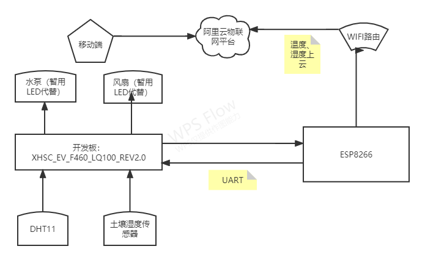
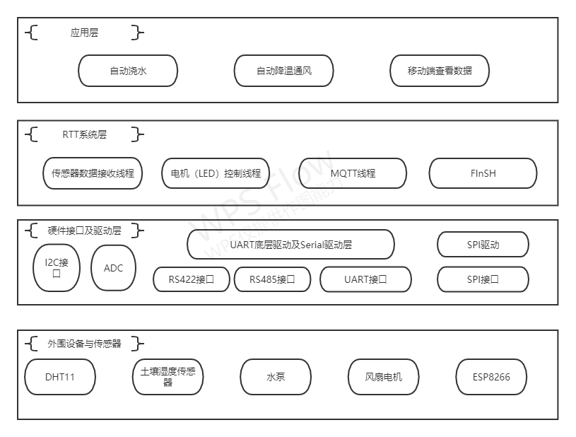
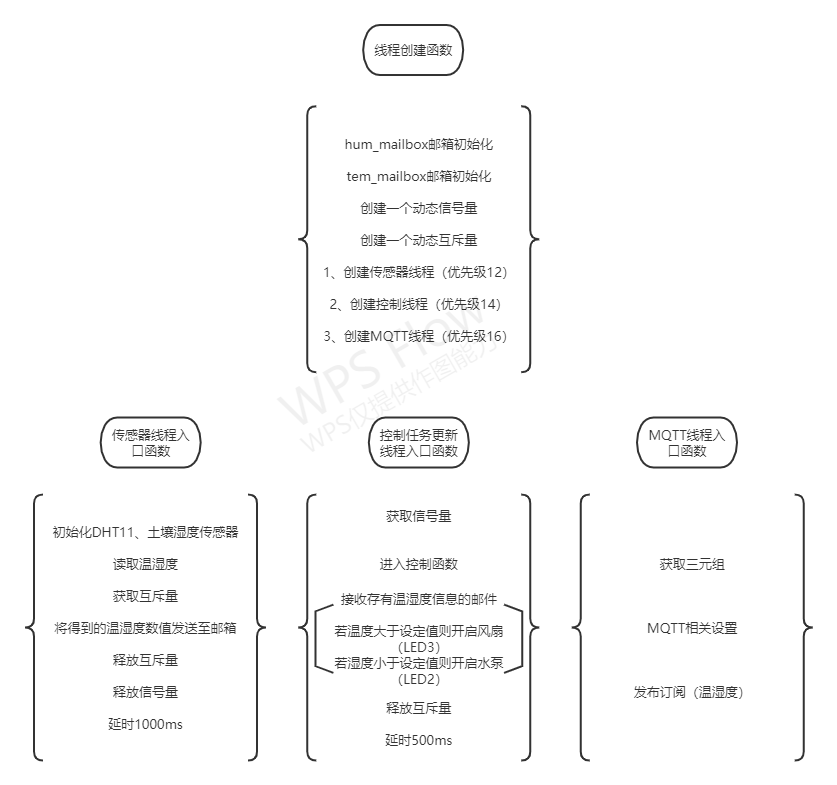
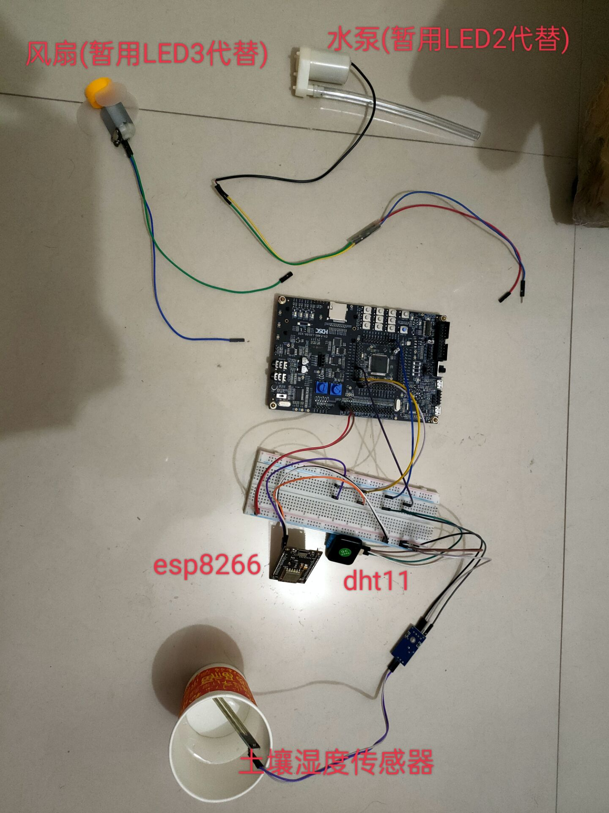

> ## 作品名称：智能浇花系统
> 
> ## 目录

- 1. 作品背景

- 2. 实现功能

- 3. 硬件框架

- 4. 软件框架

- 5. RT-Thread使用情况概述

- 6. 软件流程图

- 7. 硬件接线说明与实物图
  8. 视频演示-bilibili链接

### [1.作品背景]

    该作品旨在设计一个智能浇花系统
    现在有很多人士，他们喜爱盆栽，却时常忙碌导致无暇顾及家中搁置已久的花花草草
    有了这个系统，便可以保证植物始终处在一个合适的生长环境中，无需主人照看
    当然，你也随时可以在移动端查看盆栽所处的环境状态

### [2.实现功能]

    实时监测盆栽所处环境的温度以及盆栽土壤的湿度，并完成数据上云
    当温度超过阈值时，会开启风扇降温通风（LED3）
    当湿度低于阈值时，会开启水泵给盆栽浇水（LED2）

### [3.硬件框架]

### [4.软件框架]

### [5.RT-Thread使用情况概述]

- 5.1 内核函数使用情况
  
  > (1) 消息邮箱。使用消息邮箱实现温湿度的发送与读取
  > (2) 信号量。通过信号量实现传感器数据获取任务与控制任务的同步。  
  > (3)互斥量。通过互斥量对临界区（发送邮箱）进行保护。

- 5.2 软件包使用情况
  
  > (1) at_device-latest软件包
  > (2) cJSON-latest软件包
  > (3) ali-iotkit-V3.0.1软件包

- 5.3 设备驱动框架使用情况
  
  > (1) pin设备驱动框架
  > (2) UART设备驱动框架
  > (3) Sensor设备驱动框架
  > (4) ADC设备驱动框架

### [6.软件流程图]

### [7.硬件接线说明与实物图]

#### 硬件包含：

    1. DHT11(`单总线`)  
    2. 土壤湿度传感器(`ADC驱动`)  
    3. ESP8266(`UART驱动`)  
    4.电机1（水泵），电机2（风扇）
    5.继电器
    6.L298N电机驱动
    7. HC32F460

#### 硬件接线：

- DHT11: Data - PD1

- ESP8266: RX- PA2——TX-PA3

- 土壤湿度传感器：AO - PC2

#### 实物图：

### [视频演示-bilibili链接]

https://www.bilibili.com/video/BV1uW4y117sQ?spm_id_from=333.999.0.0&vd_source=1d12ce53f07558023d98553a16cdef40